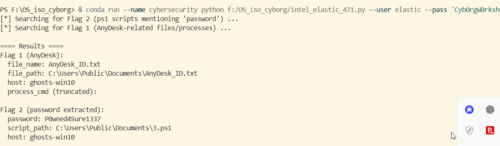

# Incident Report — Flags 1 & 2 (AnyDesk) — Updated with exclusion filters

*Prepared for workshop submission / SOC ticketing — concise, evidence-backed, and actionable.*

---

## Executive summary

During the Intel 471 hands-on hunt lab you identified two artifacts (Flags) showing an attacker-style use of AnyDesk:

* **Flag 1 (AnyDesk ID file):** `C:\Users\Public\Documents\AnyDesk_ID.txt` — **created** by `powershell.exe` (SYSTEM) on host **Ghosts-Win10**. This file holds the victim’s AnyDesk ID and was created as part of the install/automation flow.
* **Flag 2 (Unattended password):** PowerShell script `C:\Users\Public\Documents\3.ps1` (ScriptBlock / EventID 4104) contained the literal unattended access password **`P0wned4Sure1337`** and the target AnyDesk ID `1 012 142 626`. The script downloads AnyDesk, installs it, and pipes the password into the AnyDesk process with `--with-password`.

Both findings were located via Elasticsearch/Kibana queries (KQL) and are supported by Sysmon and PowerShell operational logs. Below are the full findings, timeline, detections used, recommended containment, exclusion filters used to remove noise, and next steps.

---

## Exclusion variables (why & what to exclude)

While hunting you should exclude known-good binaries and deliberate lab tools that create a lot of noise. In this environment we excluded the following known benign entries (adjust for your environment):

**Common exclusions used in queries**

* `C:\Windows\System32\calc.exe`
* `C:\Windows\System32\taskmgr.exe`
* `C:\Users\jamesmurphy\Desktop\ONENOTE.EXE`
* `C:\exercise\ghosts\ghosts-client-x64-v8.0.0\ghosts.exe` (lab tool)
* `C:\Users\jamesmurphy\Desktop\Code.exe`
* `C:\Program Files\Microsoft OneDrive\StandaloneUpdater\OneDriveSetup.exe`
* `C:\Program Files\Microsoft OneDrive\Update\OneDriveSetup.exe`

**Why:** These produce many Run-key / file-create / process events in the dataset and drown out the suspicious results; excluding them helps surface the 3–5 high-signal rows (like the `1.exe` / `AnyDesk` artifacts).

---


## Elasticsearch (HTTP/DSL) — Python-friendly body examples

**Python `requests` body for Flag 2 (with exclusions in `must_not`)**

```python
body = {
  "size": 50,
  "_source": ["@timestamp","message","file.path","file.name","powershell.file.script_block_text"],
  "query": {
    "bool": {
      "must": [
        {"wildcard": {"file.name": "*ps1*"}},
        {"query_string": {"default_field": "message", "query": "*password*"}}
      ],
      "must_not": [
        {"wildcard": {"file.path": "*\\Windows\\System32\\calc.exe"}},
        {"wildcard": {"file.path": "*\\Windows\\System32\\taskmgr.exe"}},
        {"wildcard": {"file.path": "*\\Users\\jamesmurphy\\Desktop\\ONENOTE.EXE"}},
        {"wildcard": {"file.path": "*\\exercise\\ghosts\\ghosts-client-x64-v8.0.0\\ghosts.exe"}},
        {"wildcard": {"file.path": "*\\Users\\jamesmurphy\\Desktop\\Code.exe"}}
      ]
    }
  },
  "sort": [{"@timestamp":{"order":"desc"}}]
}
```

**Python `requests` body for Flag 1 (AnyDesk file)**

```python
body = {
  "size": 50,
  "_source": ["@timestamp","file.path","file.name","process.command_line"],
  "query": {
    "bool": {
      "should": [
         {"wildcard": {"file.name": "*AnyDesk*"}},
         {"wildcard": {"file.path": "*AnyDesk*"}},
         {"query_string": {"default_field":"process.command_line", "query":"*anydesk*"}}
      ],
      "minimum_should_match": 1,
      "must_not": [
         {"wildcard": {"file.path": "*\\Program Files\\Microsoft OneDrive*"}},
         {"wildcard": {"file.path": "*\\Users\\jamesmurphy\\Desktop\\Code.exe*"}},
         {"wildcard": {"file.path": "*\\exercise\\ghosts\\*"}}
      ]
    }
  },
  "sort": [{"@timestamp":{"order":"desc"}}]
}
```

> Tip: adapt the wildcard paths to your environment. If fields are `keyword` (case-sensitive) switch to normal `file.name:"AnyDesk_ID.txt"` or use lowercase comparisons.

---

## Flags (short answers) — unchanged (for convenience)

**Flag 1**

* File: `C:\Users\Public\Documents\AnyDesk_ID.txt`
* Created by: `powershell.exe` (SYSTEM)
* Host: `ghosts-win10` (10.10.30.125)
* Evidence timestamp: `2025-09-16 21:16:09.107`

**Flag 2**

* Password: `P0wned4Sure1337`
* Found in: `C:\Users\Public\Documents\3.ps1` (PowerShell ScriptBlock event 4104)
* Evidence: script contains `$unattendedPassword = "P0wned4Sure1337"` and `echo $unattendedPassword | & $anydeskExe $targetAnyDeskID --with-password`

---

## MITRE ATT&CK mapping (concise)

* **T1059.001 — PowerShell** — script execution & staging.
* **T1105 — Ingress Tool Transfer** — `Invoke-WebRequest` downloading `AnyDesk.exe`.
* **T1219 — Remote Access Tools** — AnyDesk used for interactive access.
* **T1547.001 — Registry Run Keys / Startup Folder** — potential persistence via `--start-with-win`.
* **T1027 — Obfuscated Files or Information** — watch for encoded PowerShell in other cases.

---

## Detections & alert tuning (with exclusions)

1. **Alert (High)**

   ```kql
   winlog.event_id:4104 and powershell.file.script_block_text:/download.anydesk.com|--with-password|Invoke-WebRequest|OutFile/i
   and not powershell.file.script_block_text:/ghosts-client|ONENOTE|calc/i
   ```
2. **Alert (Medium)**

   ```kql
   event.code:11 and file.name:*AnyDesk* and not file.path:*OneDrive* and not file.path:*ghosts-client*
   ```
3. **Alert (Low)**

   ```kql
   process.command_line:*anydesk* and not process.command_line:*OneDriveSetup.exe* and not process.command_line:*ghosts-client*
   ```

---

## Triage & containment (summary)

* Isolate `ghosts-win10`, collect `3.ps1`, `AnyDesk_ID.txt`, `AnyDesk.exe` (if present), registry keys, and PowerShell 4104 events.
* Kill AnyDesk process and block executable/hash; remove persistence only after artifact collection.
* Hunt estate-wide using the **queries above** but include the `must_not` exclusions to reduce false positives.

---
# OUTPUT


[]

---